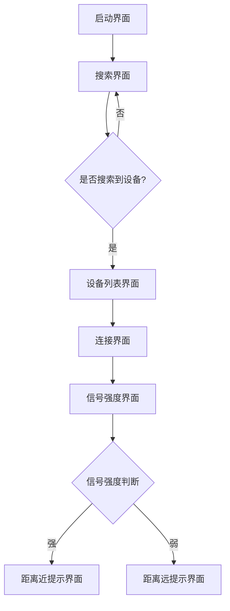

```mermaid
graph TD
    A[启动界面] --> B[搜索界面]
    B --> C{是否搜索到设备?}
    C -->|否| B
    C --> |是| D[设备列表界面]
    D --> E[连接界面]
    E --> F[信号强度界面]
    F --> G{信号强度判断}
    G --> |强| H[距离近提示界面]
    G --> |弱| I[距离远提示界面]
```

